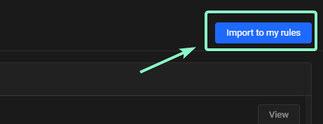
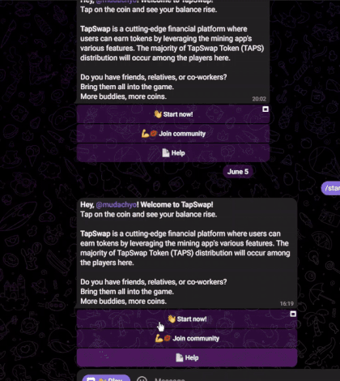

> [!NOTE]
> - Контакты: [Telegram](https://t.me/mudachyo) 
> - Канал: [Telegram Channel](https://t.me/shopalenka) 
> - 🇪🇳 README in english available [here](README-EN.md)
---
## Как запустить  
- Установить в свой бразуер расширение [Requestly](https://chromewebstore.google.com/detail/requestly-intercept-modif/mdnleldcmiljblolnjhpnblkcekpdkpa)
- Открыть https://app.requestly.io/rules#sharedList/1718187351742-ts-web
- Нажать _Import to my rules_ справа сверху  
## Автокликер
- Откройте https://app.requestly.io/rules#sharedList/1718187394054-Ts-Autoclicker
- Нажмите Import to my rules справа сверху
  
### Открыть [Бота TapSwap](https://web.telegram.org/k/#?tgaddr=tg%3A%2F%2Fresolve%3Fdomain%3D@tapswap_bot%26start%3Dr_2475526) и запустить игру
## [Смотреть видео на YouTube](https://www.youtube.com/watch?v=m_9a2gd6NhI)
- 

---
> [!TIP]
> Другие репозитории:
> 
> - [Hamster Kombat + Autoclicker](https://github.com/mudachyo/Hamster-Kombat)
> 
> - [TapSwap + Autoclicker](https://github.com/mudachyo/TapSwap)
> 
> - [Blum + Autoclicker](https://github.com/mudachyo/Blum)
>
> - [PixelTap + Autoclicker](https://github.com/mudachyo/PixelTap)
> 
> - [MemeFi + Autoclicker](https://github.com/mudachyo/MemeFi-Coin)
---
> [!IMPORTANT] 
> Пожертвование
> 
> Мы принимаем следующие криптовалюты:
> 
> - **TON**: `UQCGUzPN5GnFqWJiYsFtqqLGO75-cBXlOL8f_qbd7yKY2Tzh`
> 
> - **USDT**(TRC20): `TFr8CiAPqEnSyoXHtVefWumodcXgjoB8rS`
> 
> - **USDT**(TON): `UQCGUzPN5GnFqWJiYsFtqqLGO75-cBXlOL8f_qbd7yKY2Tzh`
> 
> - **NOTCOIN**(TON): `UQCGUzPN5GnFqWJiYsFtqqLGO75-cBXlOL8f_qbd7yKY2Tzh`
> 
> - **BTC**: `1Mba8xKKVLdcFJdV7jD8Ba3fFn7DWbp4bt`
> 
> Пожертвования будут использованы для поддержания/сохранения проекта.
